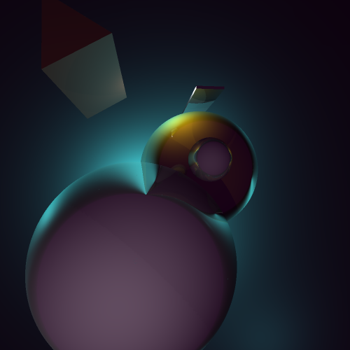

Files' descriptions:

* stage.cpp - the scene, camera position, light sources, materials are set here.

* primitive.cpp/h - here the classes of primitives and fractals are described, as well as the class of the light source, and the camera (eye).

* raything.cpp/h - here are implemented the algorithms of raytracing and raymarching as well as additional effects. All important constants are also described here. Also, beam and impact classes are described here.

* resorigin.bmp - this is a visualization of the scene, in the background is a box of large, but finite size. This gives such a strange effect of reflection on figures. 

* restet.bmp -  the recursive tetrahedron   [source](http://blog.hvidtfeldts.net/index.php/2011/08/distance-estimated-3d-fractals-iii-folding-space/) 

* resF.bmp - Mandelbulb [source](http://blog.hvidtfeldts.net/index.php/2011/09/distance-estimated-3d-fractals-v-the-mandelbulb-different-de-approximations/)  

